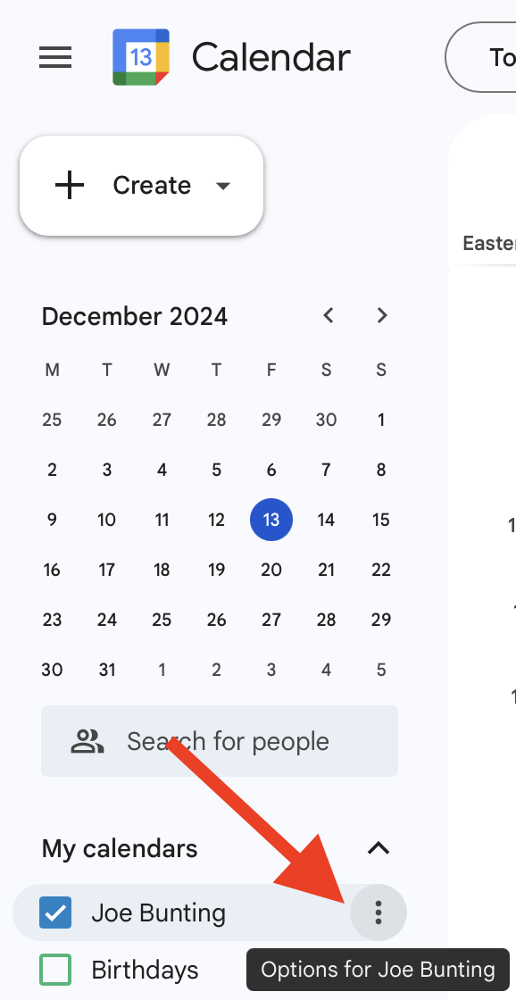
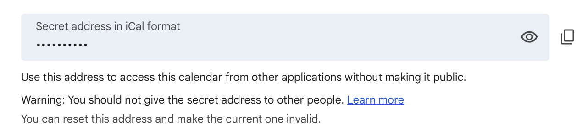
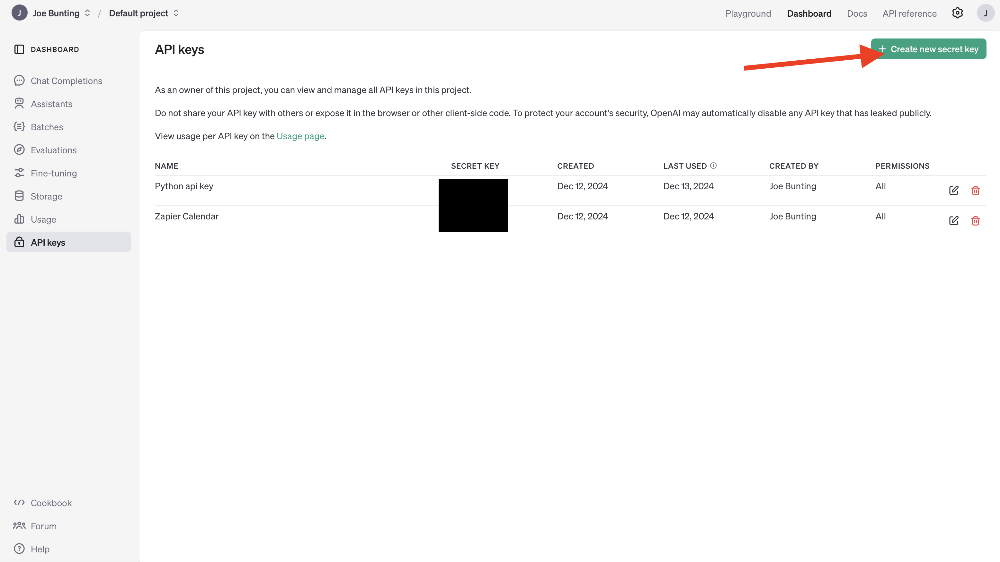
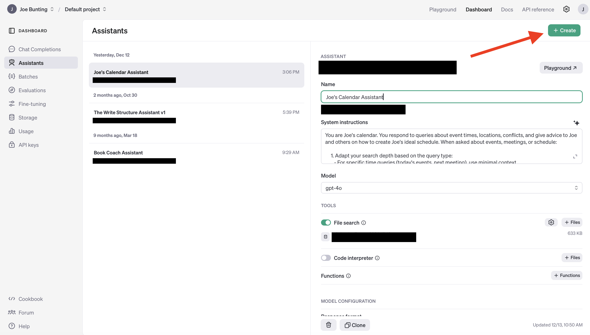

# Calendar AI Sync for Mac

This system automatically syncs your calendar with an OpenAI Assistant, allowing you to query your calendar using natural language. It runs hourly and provides desktop notifications for updates. It currently only works for Mac.

## Installation

0. Install Python (if not already installed):
   - Download Python 3.13 or later from [python.org](https://www.python.org/downloads/macos/)
   - During installation, make sure to check "Add Python to PATH"
   - Verify installation by opening Terminal and running:
     ```bash
     python3 --version
     ```

1. Run the setup script to install dependencies and create initial configuration:
```bash
python3 setup.py
```

2. Get your credentials:

   a. Get your Google Calendar URL:
      - Open Google Calendar (https://calendar.google.com)
      - In the left sidebar, click the 3 dots next to your calendar name
      
      - Select "Settings and sharing"
      - Scroll down to "Secret address in iCal format"
      
      - Copy the URL (it should look like: https://calendar.google.com/calendar/ical/your-email/private-key/basic.ics)

   b. Get your OpenAI API key:
      - Go to [OpenAI Platform](https://platform.openai.com/api-keys)
      - Click "Create new secret key"
      
      - Copy the key (starts with "sk-")

   c. Create your OpenAI Assistant:
      - Go to [OpenAI Platform](https://platform.openai.com/assistants)
      - Click "Create Assistant"
      
      - Follow the "Create OpenAI Assistant" section below
      - Copy the Assistant ID (starts with "asst_")

3. Add these credentials to your `.env` file:
```env
# Add your credentials from step 2
OPENAI_API_KEY=sk-your-api-key-here
CALENDAR_URL=your-google-calendar-url-here
CALENDAR_ASSISTANT_ID=asst-your-assistant-id-here

# System paths are configured automatically - no need to edit
```

4. Install and start the service:
```bash
python3 install.py
```

The service will:
- Run automatically every hour
- Download your calendar events
- Update your OpenAI Assistant
- Show desktop notifications for updates

You can check if it's working by viewing the logs:
```bash
tail -f logs/calendar_service.log
```

## Managing the Service

To uninstall the service:
```bash
python3 uninstall.py
```

## Components

- `get-calendar.py`: Downloads calendar events and formats them with natural language descriptions
- `calendar-to-openai.py`: Uploads calendar data to OpenAI as a vector store
- `update_calendar_cron.py`: Orchestrates the updates and provides notifications
- `com.user.calendarupdate.plist`: LaunchAgent for automatic startup and background running

## Configure Your Assistant

Here are some suggestions to configure your assistant:

   - Name: "Calendar Assistant"
   - Model: GPT-4o (recommended)
   - Instructions: 
     ```
     You are Joe's calendar. You respond to queries about event times, locations, conflicts, and give advice to Joe and others on how to create Joe's ideal schedule. When asked about events, meetings, or schedule:

     1. Adapt your search depth based on the query type:
        - For specific time queries (today's events, next meeting), use minimal context
        - For schedule analysis (patterns, optimization), use maximum context
        - For conflict checking, ensure comprehensive coverage

     2. Search the calendar data for relevant information:
        - Use specific date ranges when provided
        - Consider timezone and time-of-day context
        - Look for related or recurring events

     3. Provide clear, concise responses about:
        - Times and dates in a readable format
        - Locations and meeting details
        - Event durations and gaps between events

     4. For schedule analysis and advice:
        - Consider the entire schedule
        - Look for patterns and inefficiencies
        - Suggest improvements based on observed habits
        - Consider work/life balance

     5. Always:
        - Mention specific dates and times in your responses
        - Indicate if you need more context
        - Say clearly if information isn't in the calendar
        - Format responses for easy reading

     6. When giving scheduling advice:
        - Consider Joe's typical patterns
        - Suggest optimal meeting times
        - Identify potential conflicts
        - Recommend schedule improvements
     ```
   - Tools: Enable "File Search" (retrieval)
   - Save the Assistant ID for your `.env` file

The system will automatically upload your calendar data to this assistant when it runs.

## How It Works

1. The system runs every hour automatically
2. Downloads your calendar events
3. Formats them with natural language descriptions
4. Creates a vector store in OpenAI
5. Updates the Assistant with the new calendar data
6. Provides desktop notifications for updates and errors

## Logs

- Main log: `calendar_updates.log`
- Service output: `calendar_service_output.log`
- Service errors: `calendar_service_error.log`

## Managing the Service

To stop the service:

```bash
launchctl unload ~/Library/LaunchAgents/com.user.calendarupdate.plist
```

To start the service:

```bash
launchctl load ~/Library/LaunchAgents/com.user.calendarupdate.plist
```

To check status:

```bash
launchctl list | grep com.user.calendarupdate
```


## Troubleshooting

If the service isn't running:
1. Check the log files for errors
2. Verify Python path in the plist file
3. Ensure all environment variables are set
4. Check file permissions

## Dependencies

- Python 3.13+
- OpenAI API access
- iCal-compatible calendar
- macOS for notifications


## Testing the Assistant

1. Go to the Assistant in the OpenAI Platform
2. Click "Test" in the preview window
3. Try some example queries:
   - "What meetings do I have today?"
   - "When is my next appointment?"
   - "Do I have any conflicts this week?"
   - "What's on my schedule for next Monday?"

# Sensitive files
.env
Calendars/*.json

# Logs
*.log

# Python
__pycache__/
*.py[cod]
*$py.class

## License

MIT License

Copyright (c) 2024 Joe Bunting

Permission is hereby granted, free of charge, to any person obtaining a copy
of this software and associated documentation files (the "Software"), to deal
in the Software without restriction, including without limitation the rights
to use, copy, modify, merge, publish, distribute, sublicense, and/or sell
copies of the Software, and to permit persons to whom the Software is
furnished to do so, subject to the following conditions:

The above copyright notice and this permission notice shall be included in all
copies or substantial portions of the Software.

THE SOFTWARE IS PROVIDED "AS IS", WITHOUT WARRANTY OF ANY KIND, EXPRESS OR
IMPLIED, INCLUDING BUT NOT LIMITED TO THE WARRANTIES OF MERCHANTABILITY,
FITNESS FOR A PARTICULAR PURPOSE AND NONINFRINGEMENT. IN NO EVENT SHALL THE
AUTHORS OR COPYRIGHT HOLDERS BE LIABLE FOR ANY CLAIM, DAMAGES OR OTHER
LIABILITY, WHETHER IN AN ACTION OF CONTRACT, TORT OR OTHERWISE, ARISING FROM,
OUT OF OR IN CONNECTION WITH THE SOFTWARE OR THE USE OR OTHER DEALINGS IN THE
SOFTWARE.
